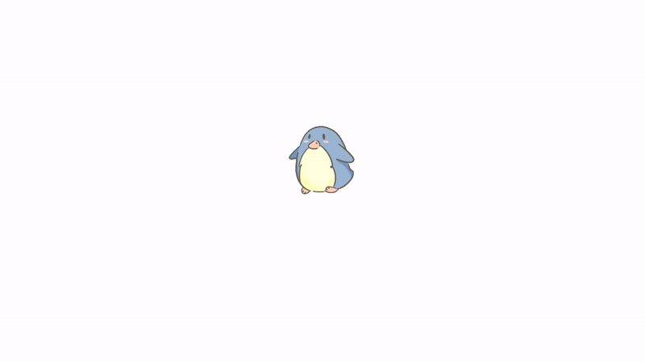

  

<h1>About Me</h1>

Hi, I'm <b>Yojan Karki</b>, a code blooded animal who enjoys working on .NET MVC with a strong enthusiasm for the MERN stack. I enjoy crafting user interfaces and am currently exploring the world of AngularJS. Passionate about coding, a fan of React.js and Express.js, and fueled by coffee, I thrive in building engaging and efficient applications.

 .<a href="https://drive.google.com/file/d/1sPR8HES8N54lsQrZAPx9Ge-T9kJXxgBt/view?usp=drive_link">Resume</a>.

 

 
<i>"A passionate software developer from Nepal, specializing in .NET technology and crafting dynamic user interfaces with Angular and ReactJs. "</i>

       

<strong>your future buddy to discuss .NET, JavaScript and tech in general on.<strong>
 
 

 

  

